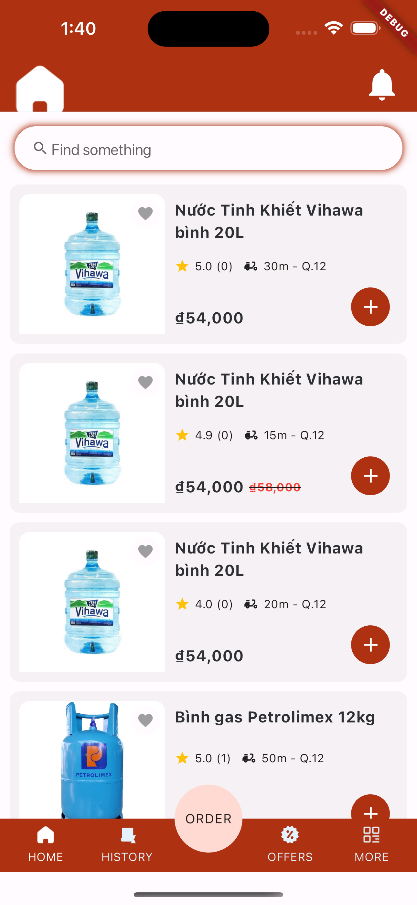
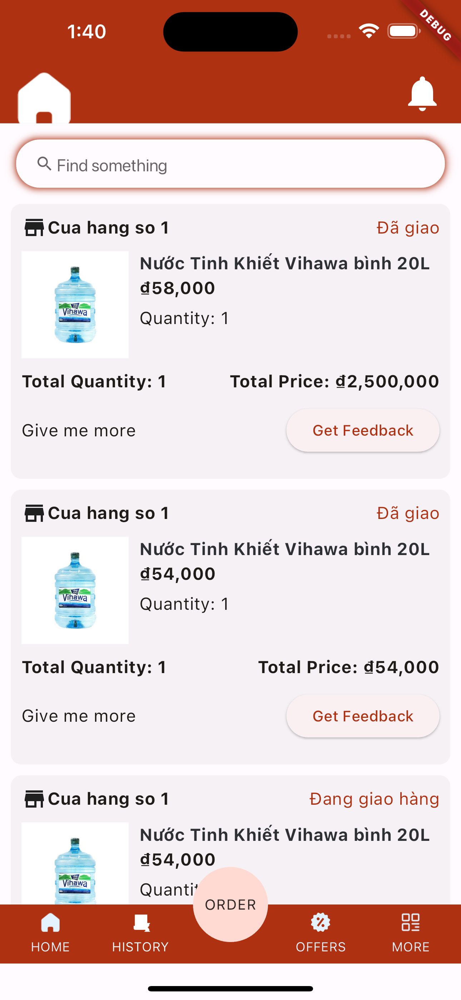

## Moco

### Introduction

Moco application is a mobile application developed using Flutter, aimed at helping users easily order necessary goods within their living area. This project creates a bridge between consumers and local stores/parts/services businesses, helping them save time and effort in the shopping process.

### Screenshots



### Features

1. **Product Search**: Users can search for specific products by name or category in the surrounding area.
2. **Store Listing**: Displays a list of stores that have the desired products available, along with information about address, distance, and ratings from other users.
3. **Online Ordering**: Allows users to place orders online and choose suitable payment methods.
4. **Order Notifications**: Users will receive notifications about the status of their orders, from order confirmation to the shipping process.
5. **Order History**: Displays a history of orders placed so that users can easily track them.

### Installation Requirements

To install and run the application, you need:

- Flutter SDK installed on your computer.
- An emulator or mobile device to run the application.

### Installation Instructions

1. Clone the repository from GitHub:

    ```
    git clone <repository-link>
    ```

2. Navigate to the project directory:

    ```
    cd project-directory
    ```

3. Install dependencies:

    ```
    flutter pub get
    ```

4. Run the application on an emulator or mobile device:

    ```
    make run
    ```

### Contribution

If you wish to contribute to the project, please open a pull request on GitHub. We welcome contributions from the community.